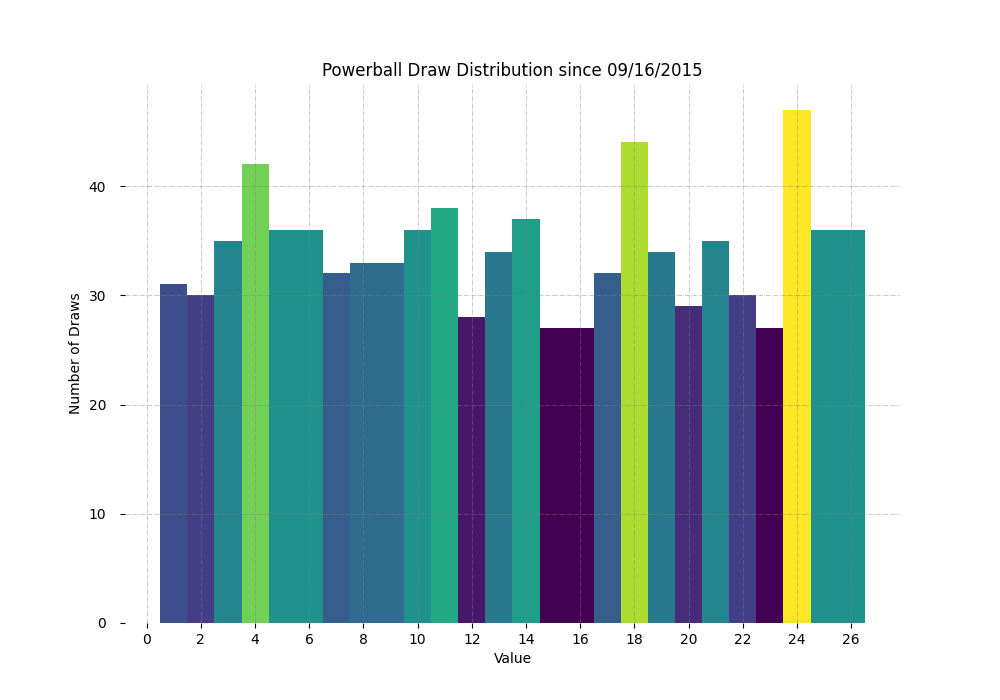
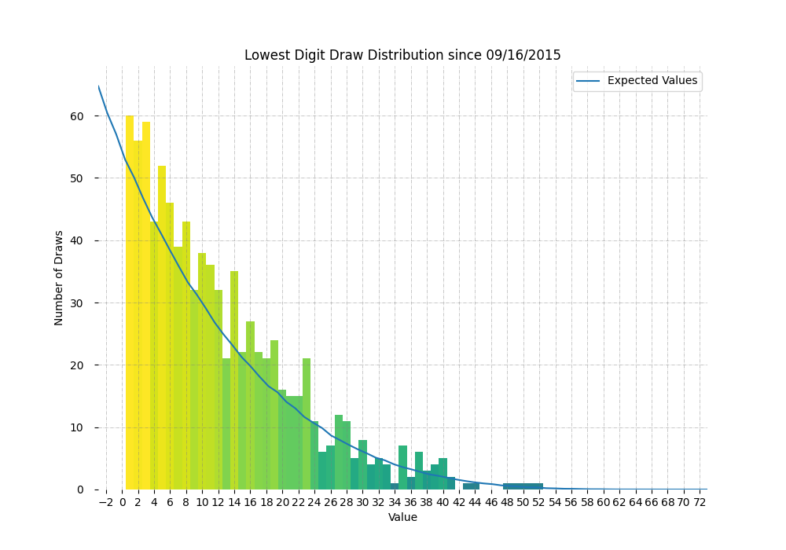
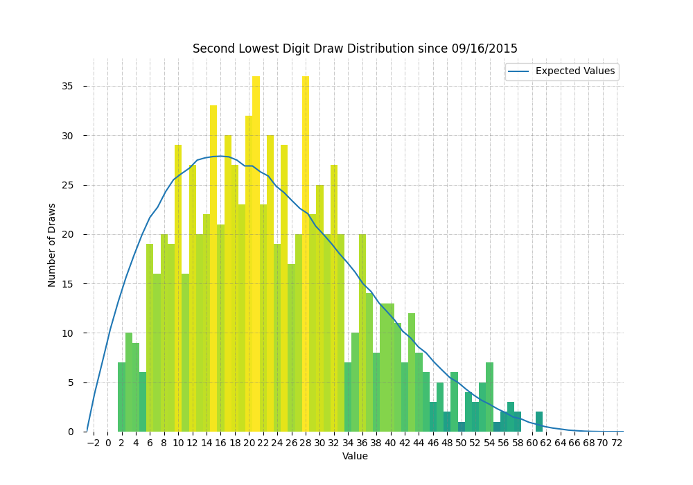
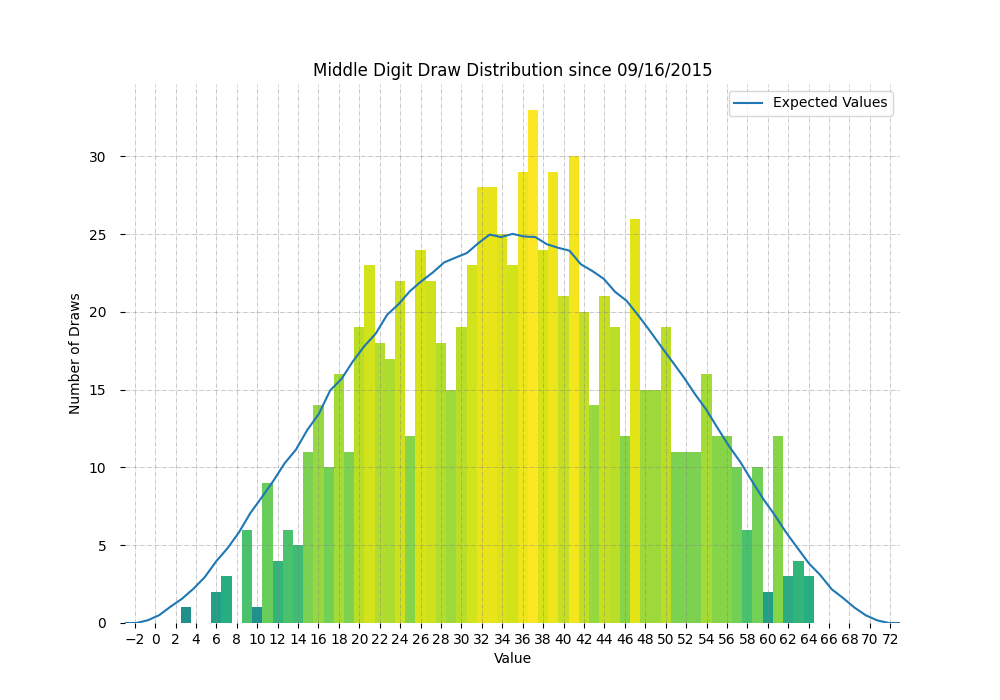
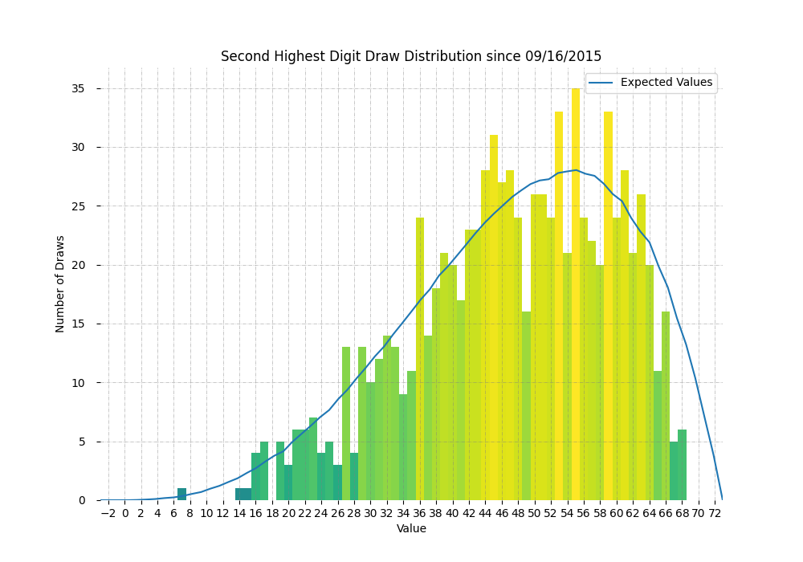
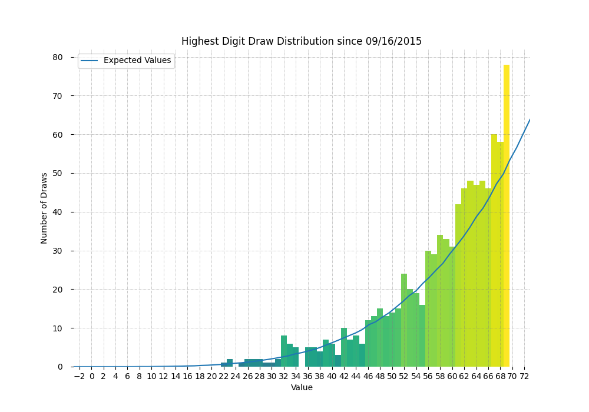

# AP Stat Final Project 📝

This is a final project for my AP Stats Class

## Introduction

Powerball is a game in the New York lottery as well as in other states lotteries that involves selecting 5 numbers from a set of 69 white balls and one number from 26 red Powerballs as by the latest rules with the 2015 revsion to the game. The minimum bet is $2. The Powerball is selected from a seperate pool of balls as the five white balls are selected from a range of 69 balls without replacement.
These draws are preformed on television with various cashouts depending on the current jackpot as well as the amount of balls correctly selected. The method that powerball uses appers
on the surface to be a random process of selection although this experiment sought out to determine if this is true by determining if the powerball draw is random, or if there is a
certain number with a higher probablility. This experiment further set out to determine wether each individual white ball value was random, as the white balls are listed in order from the previous draws.

## Methods

The data was sourced from New York State Government Data although the dataset was cut from ranging back to 2010 to 2015 because of the rule change.

Source: https://data.ny.gov/Government-Finance/Powerball-History/dhwa-m6y4

### 1. Data Processing

Initially the csv cut rows before 09/16/2015, as that marked the rule change in the data. For processing the data the csv red the center column and converted the string representing the numbers into 2 numpy arrays
the first was to represent the white balls as it was a a matrix with 5 rows and the other was a vector to represent the powerballs.

### 2. Chi Squared Goodness of Fit Test Conditions and Hypothesis

To analyze each powerball the following conditions had to be met to run a Chi Squared Goodness of Fit infrence Procedure:

+ All draw numbers have been drawn at least more than 5 times
+ Each powerball number draw is independent
+ Population was used for data analysis

The hypothesis for these inference procedures are as follows:

+ H0 = The powerball draws will be random and have an equal probability for each outcome
+ Ha = The powerball draws are not random as they do not all share an equal probability of being drawn

### 3. Chi Squared Goodness of Fit Test for Powerball

Python was used to run a Chi Squared Goodness of Fit test for the Powerball data with the expected value being the probability of a number being picked given that they were all equal probablily. This means that the expected values for the
powerball were caulcuated as follows:

^2}{Expected})

Then the Chi Squared statistic is used with the degrees of freedom(draw size - 1) to calculate the p-value
with the use of a Chi-Squared distribition. The expected values used are set to 1/26 as all numbers drawn are from 1 to 26. The code to compute the p-value is as shown bellow:

    def Chi_Squared_GOF_Test(power_ball_data, catagories):

        observed_counts = []
        expected_counts = []
        count = 0

        #setting observed counts
        for catagory in range(catagories):
        for draw in power_ball_data:
            if(draw == (catagory+1)):
            count += 1
            observed_counts.append(count)
            count = 0

        #setting expected counts
        for index in range(catagories):
        expected_counts.append((1/catagories)*len(power_ball_data))

        chi_squared = 0
        for i in range(catagories):
        chi_squared += (((observed_counts[i]-expected_counts[i])**2)/expected_counts[i])

        p_val = chi2.sf(chi_squared, catagories-1)

        return p_val

### 4. 1 Proportion Z-Test Conditions

To analyze each white ball and powerball the following conditions had to be met to run a Chi Squared Goodness of Fit infrence Procedure:

+ Every single draw number when multiplied by its corresponding population proportion is greater than 10, the same goes for the complement for the proportion
+ Random Sampling used with sample size of population
+ Draw sets are independent

The hypothesis for these inference procedures are as follows:

+ H0 = For each digit the white ball draw data proportions are not statistically significant to indicate random data
+ Ha = For each digit the white ball draw data proportions are statistically significant to claim randomness due to similarity to the random  expected proportion

### 5. Z-Test for White Ball Draw

The Z-Tests for the white ball draw involved unraveling the tensor containing all draw values, this means that all white balls
that have been drawn in the past are analyzed to compute a Z-statistic for each single number outcome 1-69.
The true population proportions are computed by counting every single draw. The expected value is set to the value 1/69 as that would indicate
and equal probability of each number being drawn. The formula bellow was used to compute the Z-statistic:

}{n}}})

Then the Z-statistic is used to determine the p value based on a normal distribution sample. The code to calculate such is as follows:

def Total_1PropZTest(r,matrix):
p_values = [0]*r
n = np.ravel(matrix).shape[0]

for i in range(len(p_values)):
P = Frequency(matrix,i+1)
P0 = 1/r
a = (P-P0)
b = P0*(1-P0)/n
z = a/math.sqrt(b)
p_values[i] = norm.cdf(z)

return p_values
The Frequency method is used to get the counts for each individual draw number to determine the proportion.
Then each p-value is compiled in a list for each catagory and printed to be manually entered into a table.

### 6. Discrete KL Divergence

Each daily draw involves 5 values organized from lowest to highest, thus we created distributions of the frequencies of each digit
for the lowest values, second lowest values, middle values, second highest values, and highest values. To compute
the expected distribution of truly random values we ran simulations to create an expected random distribution. The code to run the computer
simulation is as follows:

    def Simulate_Probabilities(r,n,trials,val):
        distribution = [0]*r
        probability_distribution = []
        list = []
        #setting observed counts
        for trial in range(trials):
        list = sample(createList(r), n)
        list.sort()
        distribution[list[val] - 1] += 1

        for i in distribution:
            probability_distribution.append(i/trials)
        return probability_distribution

Then after having both the actual and simulated distributions the discrete kl divergence could be used
to measure the similarity between both distributions. Discrete KL divergence could be calculated with the following formula:
&space;=&space;\sum_{i=1}^{n}Observed_i&space;\log{\frac{Observed_i}{Expected_i}})
Then the distribution of the observed values was ploted along with a curve representing the distribution of the expected values.
Each simmulation ran took the average of 885000 samples. The KL divergence was computed between both probability distributions.

## Results

### 1. Chi Squared Goodness of Fit Test for Powerball

The distribution of powerball values that could be observed appers as relatively random with some variance although an overall uniform distribution as seen below:

After runnning the test on the powerball data, the p-value for the chi squared goodness of fit test was: **0.8079311834118206**

### 2. Z-Test P-values

Below is a table off all of the P-Values for every single number drawn from the 5 number pool since 09/16/2015:

| Draw Number |        P-Value        |
| :-----------: | :----------------------: |
|      1      | 2.8056000005913775e-06 |
|      2      | 1.0797228600635673e-05 |
|      3      | 0.00018225357812129444 |
|      4      | 5.1504031849094886e-08 |
|      5      | 1.0913171988057328e-06 |
|      6      | 5.7315724425168394e-05 |
|      7      | 1.7578442457774803e-06 |
|      8      | 1.0797228600635673e-05 |
|      9      | 6.713244988402532e-07 |
|     10     | 8.504784956209709e-05 |
|     11     | 4.437030495398524e-06 |
|     12     | 1.0797228600635673e-05 |
|     13     | 3.1360346825700197e-09 |
|     14     | 1.0797228600635673e-05 |
|     15     | 5.7315724425168394e-05 |
|     16     | 3.8278181774552647e-05 |
|     17     | 5.7315724425168394e-05 |
|     18     | 1.661412880854524e-05 |
|     19     | 1.0797228600635673e-05 |
|     20     | 0.00018225357812129444 |
|     21     |  0.004819347455047796  |
|     22     | 1.0797228600635673e-05 |
|     23     |  0.001980008038665716  |
|     24     | 4.091853125336543e-07 |
|     25     | 8.767458454202563e-08 |
|     26     | 8.767458454202563e-08 |
|     27     | 0.0001250627431864603 |
|     28     | 0.00026321860472638796 |
|     29     | 4.091853125336543e-07 |
|     30     | 1.0797228600635673e-05 |
|     31     | 4.437030495398524e-06 |
|     32     |  0.008348152417806424  |
|     33     | 0.00026321860472638796 |
|     34     | 3.1360346825700197e-09 |
|     35     | 2.9977377815768116e-08 |
|     36     |  0.004819347455047796  |
|     37     | 0.0003767549070303206 |
|     38     | 6.713244988402532e-07 |
|     39     | 0.0007514314966090125 |
|     40     | 2.5333097567959405e-05 |
|     41     | 1.0797228600635673e-05 |
|     42     | 2.8056000005913775e-06 |
|     43     | 6.713244988402532e-07 |
|     44     | 3.8278181774552647e-05 |
|     45     | 6.953219972518732e-06 |
|     46     | 1.4787506978419587e-07 |
|     47     | 0.0003767549070303206 |
|     48     | 6.713244988402532e-07 |
|     49     | 2.9977377815768116e-08 |
|     50     | 4.437030495398524e-06 |
|     51     | 6.713244988402532e-07 |
|     52     | 1.0797228600635673e-05 |
|     53     | 0.0001250627431864603 |
|     54     | 1.0797228600635673e-05 |
|     55     | 1.661412880854524e-05 |
|     56     | 8.504784956209709e-05 |
|     57     | 1.661412880854524e-05 |
|     58     | 6.953219972518732e-06 |
|     59     | 0.0014462861065082952 |
|     60     | 6.713244988402532e-07 |
|     61     |  0.013970009041566875  |
|     62     | 0.00018225357812129444 |
|     63     |  0.00268689487593693  |
|     64     | 0.00018225357812129444 |
|     65     | 1.7578442457774803e-06 |
|     66     | 6.953219972518732e-06 |
|     67     | 2.5333097567959405e-05 |
|     68     | 1.661412880854524e-05 |
|     69     |  0.00268689487593693  |

### 3. KL Divergence Tests

#### 3a. Lowest Values

The KL Divergence value for the probability distributions are as follows: **0.029253825999191102**

The chart of both frequency distributions is as follows:

#### 3b. Second Lowest Values

The KL Divergence value for the probability distributions are as follows: **0.049525573749782024**

The chart of both frequency distributions is as follows:

#### 3c. Middle Values

The KL Divergence value for the probability distributions are as follows: **0.046680968602470035**

The chart of both frequency distributions is as follows:

#### 3d. Second Highest Values

The KL Divergence value for the probability distributions are as follows: **0.04089951198746084**

The chart of both frequency distributions is as follows:

#### 3e. Highest Values

The KL Divergence value for the probability distributions are as follows: **0.027785383702575096**

The chart of both frequency distributions is as follows:

## Conclusions
The Chi Squared Test had a p-value greater than the threshold of 0.05 meaning that we fail to reject the null hypothesis. Therefore the powerball draw is random and all choices share an equal probability of being drawn.

The 1 proportion Z-Tests for each white ball number was less than the threshold fo 0.05. This means that we can reject the null hypothesis as the the probabilites for drawing any number is random for the white balls as well.

The KL Divergence tests yeilded values that are near zero implying a relatively close overlap between the real and simulated distribtution, although the metric could seem abit arbitrary they can be qualitatively confirmed when examining the charts with both distributions plotted.